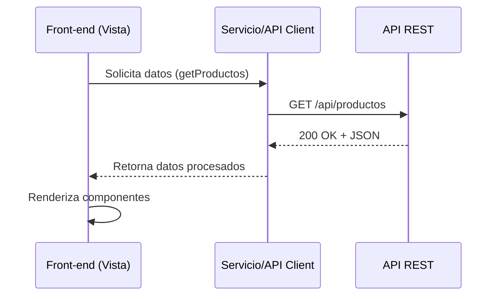
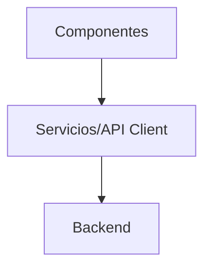
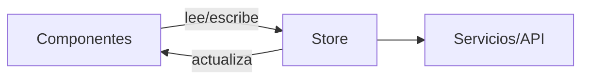
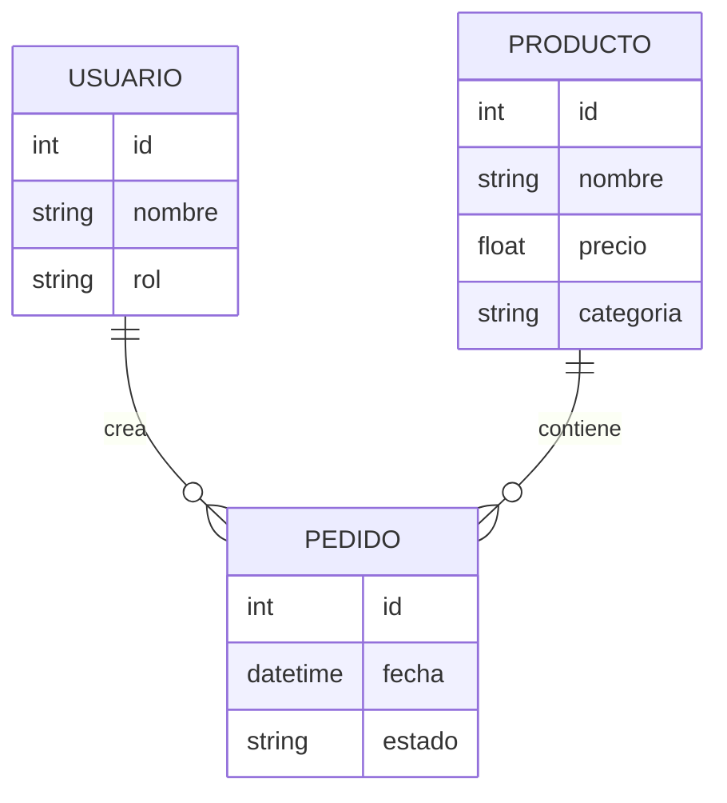
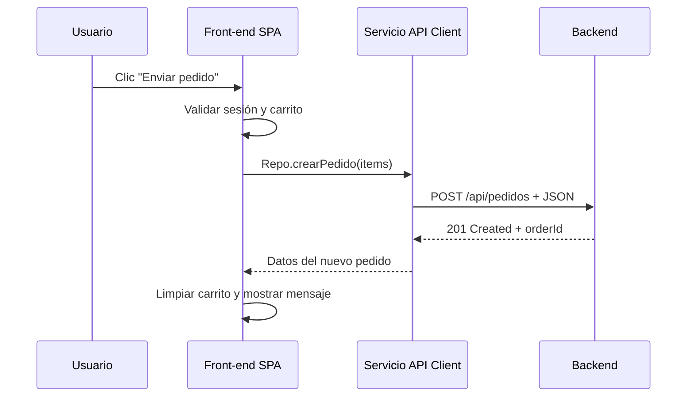
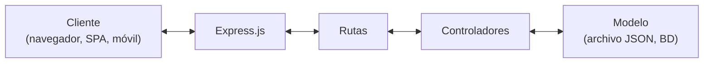
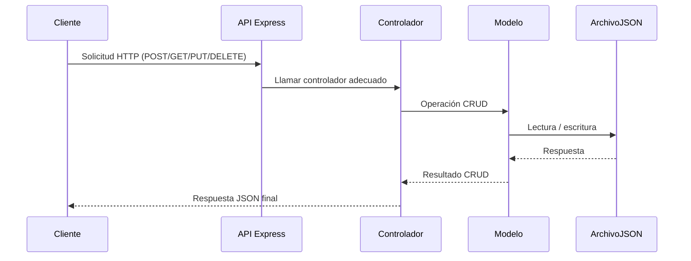
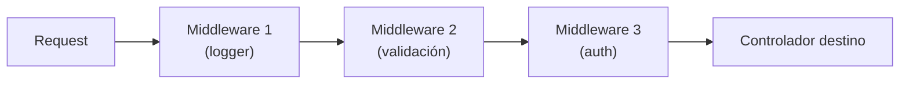
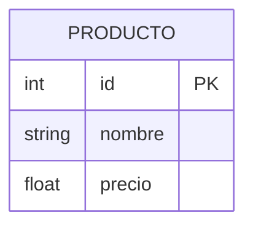

# Diagramas de referencia

Transcripciones exactas de la guía, contrastadas con las páginas originales de los PDF. Los diagramas ER de Semana 10 y Clase 9 se mantienen separados.

```mermaid
sequenceDiagram
    participant Vista as Front-end (Vista)
    participant Servicio as Servicio/API Client
    participant API as API REST
    Vista->>Servicio: Solicita datos (getProductos)
    Servicio->>API: GET /api/productos
    API-->>Servicio: 200 OK + JSON
    Servicio-->>Vista: Retorna datos procesados
    Vista->>Vista: Renderiza componentes
```

```mermaid
flowchart TD
    C["Componentes"] --> S["Servicios/API Client"]
    S --> B["Backend"]
```

```mermaid
flowchart LR
    C["Componentes"] -->|lee/escribe| S["Store"]
    S -->|actualiza| C
    S --> A["Servicios/API"]
```

```mermaid
erDiagram
    USUARIO ||--o{ PEDIDO : crea
    PRODUCTO ||--o{ PEDIDO : contiene
    USUARIO {
        int id
        string nombre
        string rol
    }
    PRODUCTO {
        int id
        string nombre
        float precio
        string categoria
    }
    PEDIDO {
        int id
        datetime fecha
        string estado
    }
```

```mermaid
sequenceDiagram
    participant U as Usuario
    participant SPA as Front-end SPA
    participant S as Servicio API Client
    participant B as Backend
    U->>SPA: Clic "Enviar pedido"
    SPA->>SPA: Validar sesión y carrito
    SPA->>S: Repo.crearPedido(items)
    S->>B: POST /api/pedidos + JSON
    B-->>S: 201 Created + orderId
    S-->>SPA: Datos del nuevo pedido
    SPA->>SPA: Limpiar carrito y mostrar mensaje
```

```mermaid
flowchart LR
    C["Cliente<br/>(navegador, SPA, móvil)"] <--> E["Express.js"]
    E <--> R["Rutas"]
    R <--> K["Controladores"]
    K <--> M["Modelo<br/>(archivo JSON, BD)"]
```

```mermaid
sequenceDiagram
    participant C as Cliente
    participant A as API Express
    participant K as Controlador
    participant M as Modelo
    participant J as ArchivoJSON
    C->>A: Solicitud HTTP (POST/GET/PUT/DELETE)
    A->>K: Llamar controlador adecuado
    K->>M: Operación CRUD
    M->>J: Lectura / escritura
    J-->>M: Respuesta
    M-->>K: Resultado CRUD
    K-->>C: Respuesta JSON final
```

```mermaid
flowchart LR
    Q["Request"] --> L["Middleware 1<br/>(logger)"]
    L --> V["Middleware 2<br/>(validación)"]
    V --> A["Middleware 3<br/>(auth)"]
    A --> C["Controlador destino"]
```

```mermaid
erDiagram
    PRODUCTO {
        int id PK
        string nombre
        float precio
    }
```
